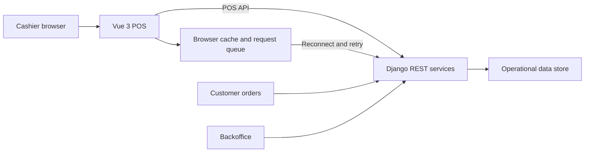

# PANN Ramyeon POS

Offline-aware restaurant point-of-sale application for cashier operations, order checkout, online-order handling, shift history, sales summaries, and payment workflows within the PANN Ramyeon Corner capstone system.

[Backoffice](https://github.com/PANNRamyeon/Ramyeon-Backoffice) · [Customer application](https://github.com/PANNRamyeon/Ramyeon-Customer) · [Shared backend](https://github.com/PANNRamyeon/Ramyeon-Backend)

## Project status

This is a team-built client capstone and working prototype. The current `main` branch contains the Vue POS frontend and a colocated Django implementation used during development. The wider suite also has a consolidated backend repository. Migration and continued development are presently paused by the client.

The former root README documented an older MongoDB setup. A sanitized copy remains available at [`docs/legacy/README.md`](docs/legacy/README.md).

## Key capabilities

- Cashier authentication and protected POS navigation
- Product browsing, category filtering, cart management, and checkout
- Discounts, promotions, and payment-processing flows
- Online-order review and status handling
- Shift, transaction-history, dashboard, and reporting views
- Configurable API integration with bearer-token handling
- Browser-side data caching and queued write attempts during connectivity loss
- Sync-oriented backend utilities for local and cloud operation

Offline behavior is best described as **offline-aware**, not fully offline-guaranteed: cached reads and queued requests exist, but complete conflict resolution and recovery still require further integration testing.

## Architecture



For the consolidated suite API and DynamoDB implementation, see [PANNRamyeon/Ramyeon-Backend](https://github.com/PANNRamyeon/Ramyeon-Backend).

## Technology stack

| Area | Technology |
|---|---|
| Frontend | Vue 3.5, Vite 6, Vue Router, Pinia |
| API client | Axios |
| UI and reporting | Bootstrap 5, custom CSS, Chart.js |
| Payments | PayMongo API integration paths |
| Frontend testing | Vitest, Vue Test Utils, jsdom |
| Colocated backend | Django 5.2, Django REST Framework |
| Offline support | Local browser cache, request queue, Django sync utilities |
| Deployment | Netlify-compatible frontend configuration |

## Repository structure

```text
frontend/               Vue cashier application
backend/                Colocated Django and offline-sync implementation
├── app/offline/        Connectivity, queue, adapter, and sync utilities
├── app/services/POS/   Cart, sales, shifts, reports, and promotions
└── settings/           Local and production settings
docs/legacy/            Sanitized historical root documentation
```

## Local setup

### Frontend

```bash
git clone https://github.com/PANNRamyeon/Ramyeon-POS.git
cd Ramyeon-POS/frontend
npm ci
```

Create `frontend/.env.local`:

```dotenv
VITE_API_URL=http://localhost:8000/api/v1
VITE_API_BASE_URL=http://localhost:8000/api/v1
VITE_PAYMONGO_PUBLIC_KEY=pk_test_placeholder
VITE_PAYMONGO_MODE=test
```

Do **not** place a PayMongo secret key or any other private credential in a `VITE_` variable. Every Vite environment value is visible in the browser. Production payment creation and verification should be performed by a trusted backend.

Start the frontend:

```bash
npm run dev
```

### Colocated backend

```bash
cd ../backend
python -m venv .venv
```

Activate the virtual environment, then install dependencies and start Django:

```bash
pip install -r requirements.txt
python manage.py runserver
```

For the shared current API, prefer the setup documented in [Ramyeon-Backend](https://github.com/PANNRamyeon/Ramyeon-Backend).

## Available frontend commands

| Command | Purpose |
|---|---|
| `npm run dev` | Start the frontend development server |
| `npm run build` | Create the production frontend build |
| `npm run preview` | Preview the build locally |
| `npm run test:unit -- --run` | Run Vitest once |
| `npx eslint .` | Check frontend lint findings without modifying files |

## Testing and validation

The current frontend has Vitest configuration but only scaffold-level automated component coverage. Django test modules also exist, but the repository does not currently provide one documented, reliable quality gate covering offline synchronization, payment flows, API integration, and complete cashier journeys.

The capstone's manual black-box evaluation is separate from the automated checks in this repository. Future work should prioritize checkout, queued-offline writes, reconnect synchronization, shifts, online-order status changes, and payment callback tests.

## Deployment

The repository's `netlify.toml` builds from `frontend/`, publishes `frontend/dist`, and configures SPA fallback routing and response headers. Configure only public frontend variables in Netlify; private payment and data credentials belong in the backend environment.

## Known limitations

- Offline queuing does not yet prove conflict-free synchronization across every transaction path.
- API base variables are not used consistently across all frontend modules.
- Client-side payment code contains secret-key configuration paths that require removal before production use.
- Frontend and backend tests are not unified into a continuous-integration workflow.
- The repository contains legacy service directories alongside newer POS modules.

## Related repositories

- [PANN Backoffice](https://github.com/PANNRamyeon/Ramyeon-Backoffice)
- [PANN POS](https://github.com/PANNRamyeon/Ramyeon-POS)
- [Ramyeon Customer](https://github.com/PANNRamyeon/Ramyeon-Customer)
- [PANN Backend](https://github.com/PANNRamyeon/Ramyeon-Backend)

## License

This repository is distributed under the [MIT License](LICENSE).
